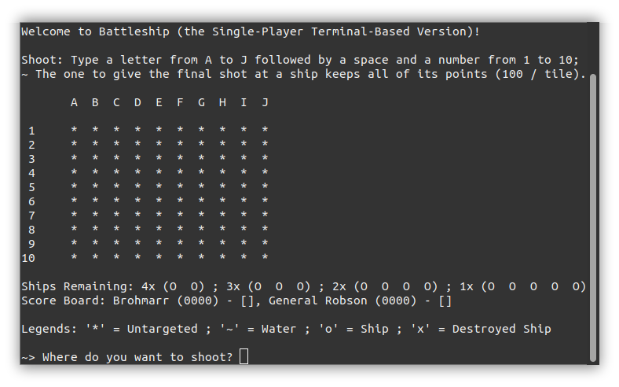

# The Battleship Game with Python

🔵 **Status:** Done

## Screenshot (Running in a GNOME Terminal Window)

## The Code
I started by creating the 4 "entities" (classes) needed in the game:

- The "Player" for the user's actions;
- The "Adversary" that controls the AI opponent's game loop;
- The "Ships" representing... Well, the ships;
- The "Game Master" for managing the game board.

After setting their attributes, I went to the "Game Master" class and created two game boards using a 2-dimensional list. The first one is the "hidden board" where the ships are positioned at randomly selected coordinates every match, and the second one is the "board" which holds the current state of the game board and starts with all of its coordinates hidden (displayed as '*'s).

Every turn, the player and the AI shoot at their chosen coordinates (checked by the "Game Master" to confirm they are valid), removing them from the list of available coordinates (from which the AI chooses a random target). The "Game Master" then updates the "board" to be the same as the "hidden board" at those coordinates, showing them to the player in the "scoreboard" and what was hiding there:

- The '~' means the shot landed in the water;
- The 'o' represents a single piece of a ship;
- Finally, the 'x' substitutes the 'o's after all parts of a ship get hit, awarding the last player who shot it a hundred (100) points multiplied by the number of pieces in that ship (from 2 to 5).

The game ends when someone destroys the last ship (totaling 10), and the one with the highest score wins.
